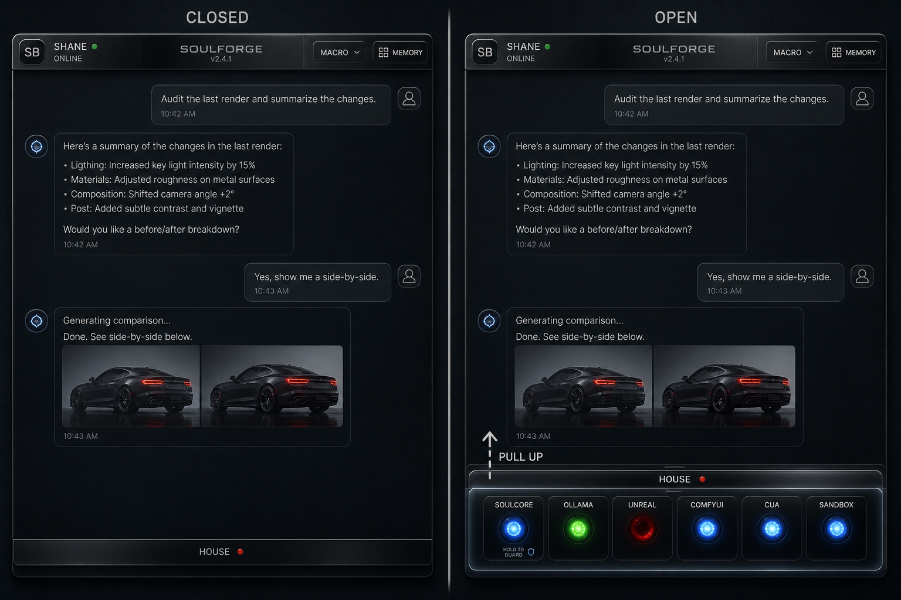

---
type: proposal-intake
prop_id: PROP-4
from: TT-01
to: PM-01
priority: P1
status: Intake — TINA-main ticketing
created: 2026-08-19
environment: TINA-main
mode: idea
title: "[TINA-main] Presence House drawer + installer/icon/updates"
proposal: docs/agents/unexecuted_proposals/presence-shell-honest-hud.md
mockup: docs/agents/unexecuted_proposals/assets/presence-lamp-drawer-closed-open.png
assignee_role: PM-01 (TINA)
---

# PROP-4 : [TINA-main] Presence House drawer + installer/icon/updates

**For:** **TINA-main** PM-01. **From:** TT-01. **Mode:** `idea`.  
**Proposal:** `docs/agents/unexecuted_proposals/presence-shell-honest-hud.md`

**Locked layout: House drawer** (rail parked). Kurt wants a **normal Windows app**: **icon + installer**, and **updates** (notify to update, or auto-update then notify — prefer **auto + toast**).

## Mockup (required — send with FED/OPS tickets)

Closed vs open House drawer:

`docs/agents/unexecuted_proposals/assets/presence-lamp-drawer-closed-open.png`

Left = **House** tab + pip, lamps hidden. Right = tray pulled up, LED wells are the switches.

## One-paragraph recommended route

Presence becomes a companion window, not a rack: identity strip + chat; **House** drawer for SoulCore/Ollama/Unreal/Comfy/CUA/Sandbox lamps (no URL, no ChatDesktop row, no intern prose). Pip if SoulCore/Unreal down while closed. Confirm/hold to stop SoulCore. Honest mood/activity (not SoulLoop slogans). Sight = timestamp + folder on **scratch** only; memory stills are copies. Texture after honesty. **Ship with .ico, Start menu shortcut, installer, update channel.**

## Suggested next tickets (not binding)

| Role | One-line |
| --- | --- |
| FED-01 | Drawer + HUD honesty + sight stamp/folder + icon in the window |
| OPS-01 | Installer + Start/desktop shortcut + Velopack-class updates (auto then notify) |
| BED-01 | `currentActivity`; HUD not driven by `loop.want` |
| SEC-01 | Signed update feed; two sight dirs; confirm Host stop |
| QA-01 | Install like a normal app; update toast; drawer matches mockup |

Do **not** block PROP-4/194/195 UE/DIGITS/Playwright on this lane.

TT-01 does not ticket FED/OPS.
